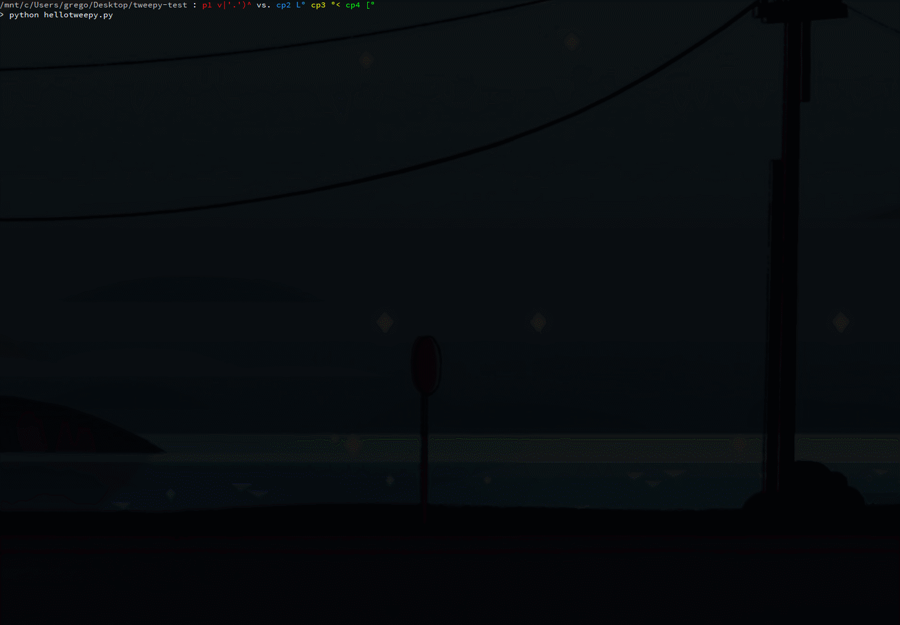

# East Bay NSBE Programming Language Exercises
Doing the thang with Python and Tweepy. Collecting tweet data on Black influencers in nerd culture.

# How it works
Put the name of the twitter account in the app and boom you got a cool app!

# Concepts
| 

 [Programming Language](Assets/HoloToolkit/Input/README.md) | 

 [Data](Assets/HoloToolkit/Sharing/README.md) | 

 [API](Assets/HoloToolkit/SpatialMapping/README.md) | 

 [Virutal Machine](Assets/HoloToolkit/SpatialUnderstanding/README.md)
| :- | :- | :- | :- |
| What computers speak. | Worlds information. | Application Programming Interface. | Simulated development environments. |

# References
- [Twitter keys and app registeration](https://apps.twitter.com/)
- [Tweepy Python library](https://github.com/tweepy/tweepy)
- [Windows 10 icons](https://graphicburger.com/200-windows-10-icons/)
