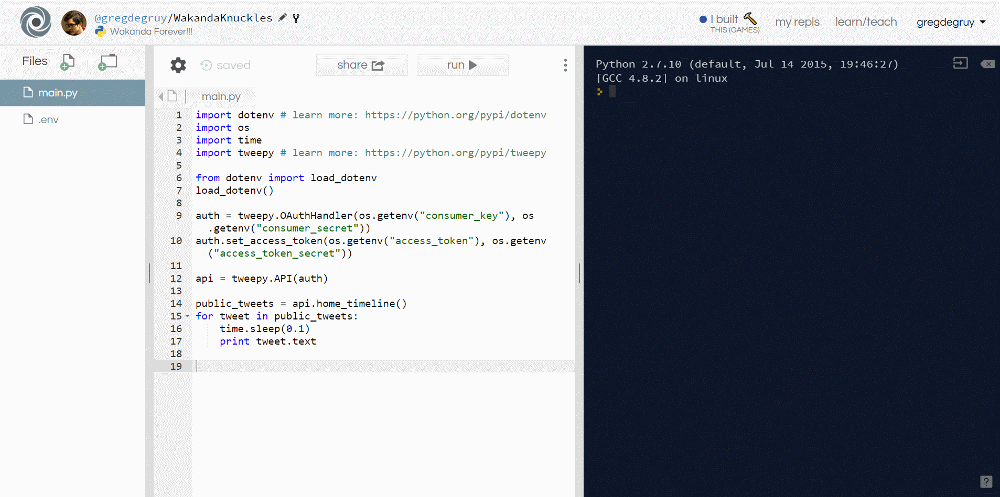

# East Bay NSBE Intro to Coding
Doing the thang with Python and Tweepy. Collecting tweet data on Black influencers in nerd culture.

# How it works
Put the name of a twitter account in the tweepy API. Done! Now you've got all this Python data at your finder tips

# Concepts
| 

 [Programming Language](Assets/HoloToolkit/Input/README.md) | 

 [Data](Assets/HoloToolkit/Sharing/README.md) | 

 [REST API](Assets/HoloToolkit/SpatialMapping/README.md) | 

 [Virutal Machine](Assets/HoloToolkit/SpatialUnderstanding/README.md)
| :- | :- | :- | :- |
| We're using Python to help our computers udnerstand what we want to do. | Tweets, Retweets, Followers and more. | Tweepy | Simulated development environments... work in progress. |

# References
Code
  - [REPL IT](https://repl.it/) for online coding
  - [Twitter keys and app registeration](https://apps.twitter.com/)
  - [Tweepy Python API](https://github.com/tweepy/tweepy)

Icons
  - [GitHub icons](https://gist.github.com/rxaviers/7360908)
  - [Windows 10 icons](https://graphicburger.com/200-windows-10-icons/)

Other
  - [GifCam](https://gifcam.en.softonic.com)
